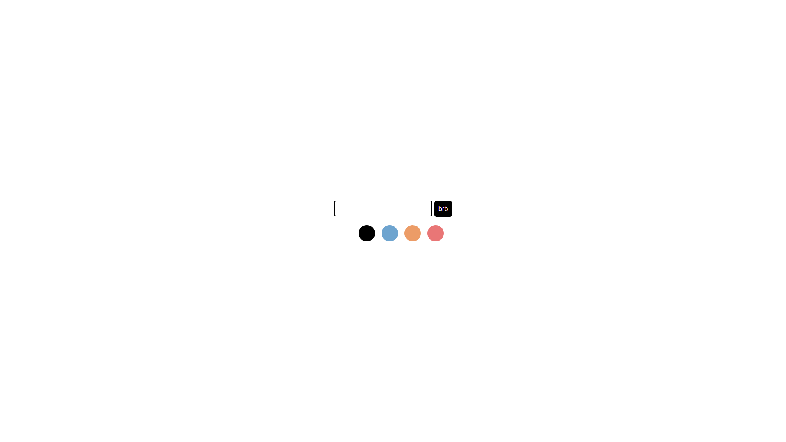

# s4 (Screen Share, Screen Saver)

## Table of Contents
- [Introduction](#introduction)
- [Tech Stack](#tech-stack)
- [Live Site](#live-site)

## Introduction
A simple webapp to display custom messages on-screen while screen sharing. Lightweight, responsive and customizable with various color themes to choose from.

## Tech Stack
* React
* Redux

## Live Site
[s4](https://intense-thicket-25944.herokuapp.com/)

## Screenshots
### View 1

### View 2

### View 3
